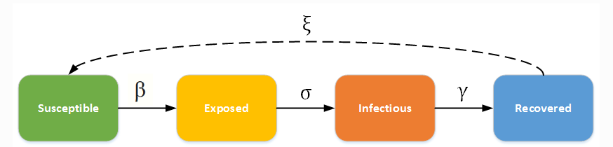
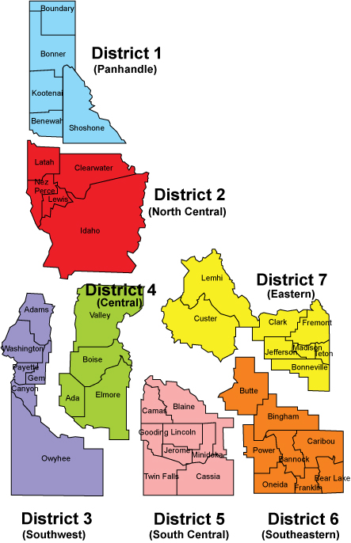
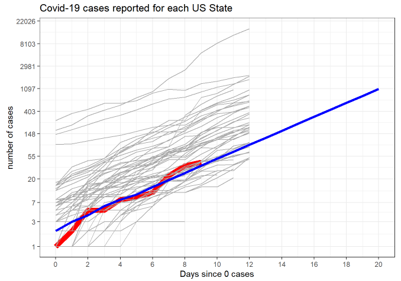

[//]: # (This is a comment that won't be rendered at github.io)
[//]: # (MD Cheat sheet: https://www.markdownguide.org/cheat-sheet/)
    
# Introduction

Covid-19 (Coronovirus) was declared a pandemic by the World Health Organization (WHO) on January 30, 2020. According to [John Hopkins University](https://coronavirus.jhu.edu/map.html) as of March 22, 169 countries/regions have reported at least one Covid-19 case; there have approximately 330,000 confirmed cases of Covid-19 and nearly 15,000 deaths. The United States (US) reported its first case in Washington on January 21. On March 13, when Idaho reported its first case, a total of 2,179 cases in the US, and 145,193 cases globally had been reported. 

On March 18, universities throughout Idaho (Boise State University, Idaho State University, and University of Idaho) were asked to identify a team of researchers to provide a report that would help predict the expected number of people in Idaho anticipated to contract Covid-19, how many of these would require hospitalization, and likely effects of different interventions. 

On March 20, a small team of researchers met with TJ Bliss (Board of Education), Martijn van Beek (Idaho Department of Health and Welfare) *[others important to mention, who outside of Idaho was on the call]*. The information provided in the document is a short summary of the number of infected, hospitalized, and dead, we could expect to see in Idaho from Covid-19. This information has been compiled from limited data sources, and during a brief period of time. Predicting Covid-19 is very difficult and there is no guarantee that the information presented below is correct. However, based on the information we had at the time, the below summarizes what we might anticipate in the coming weeks and months.

# Predictions
As mentioned above, predicting the number of infected, hospitalizations, and deaths in Idaho due to Covid-19 is difficult. We use a model to make the predictions, and there are currently many unknowns in the equations we are using. For instance, if the number of people who are exposed is higher (or lower) than the parameter in the model, the model will under (or over) estimate the number of people who become infected. While the exact value for the parameters is unknown, we can use the prior information to guess a range of plausible values. For each parameter we have examined a range of values, and we present the expected potential values based on these ranges. 

A simplistic approach of modeling Covid-19 starts with a number of people susceptible to an illness (in this case the Idaho population). 
People who are susceptible can become exposed, those who are exposed become infectious, and those who are infectious either recover or die. 
The rate at which people go from being susceptible to exposed to infected to recovery or death are major paramaters of the model, with changes in these paramters resulting in significant differences in predictions. 
This model is called a Susceptible, Exposed, Infected, and Removed (SEIR) model and it has been successfully used for other, similar, epidemics [cite]. 

*Once recovered, people can become susceptible again - is this true for the models you are running?*.

A total of xx models are presented below. Each of the models is slightly different, resulting in different predictions. 
These differences in predictions are expected given the differences in the model paramters - at this point it is unclear which model is the most realistic. More testing will result in more accurate predictions in how many people will be impacted by Covid-19. 

*Assumptions of models constent*

Model A: *brief summary*

Model B: *brief summary*

Model C: *brief summary*

Model D: *brief summary*

*[image SEIR, currently direct copy paste /plagerism from https://www.idmod.org/docs/hiv/model-seir.html] update to show a simple version of what was run for Idaho, potentially Bens' model* 

One concern is that the number of cases reported is an under-estimate. This is a significant problem as if the number of people who are infected is unknown, it becomes very difficult to predict how many people are actually infected - and contagious.
We anticipate that the number of cases on https://coronavirus.idaho.gov/ is an underestimate as not everyone is likely to present for testing (especially those who are asymptomatic), and it is also our understanding that not everyone who presents with likely Covid-19 will be tested. Given this potential under-estimate in the number of cases three different models were run.

Model 1: The model uses the number of offically recorded Covid-19 cases as reported on Mar 22, 2020. As six of the seven Public Health Districts were reporting a case of Covid-19, for simplicity the seventh Public Health District (North Central) was set to have one case as well. This resulted in a total of 48 cases in Idaho.

Model 2: The model used five times the number of Covid-19 cases than were used in Model 1, resulting in a total of 240 cases in Idaho.

Model 3: The model used ten times the number of Covid-19 cases than were used in Model 1, resulting in a total of 480 cases in Idaho.

## Additional information
There are roughly 2,500 Hospital Available Beds for Emergencies and Disasters (HAvBED) and 400 ventilators in Idaho. The approximate number of HAvBED and ventilator for each Public Health District are:

*to do - put image to right of list - label as Figure 1 (or Figure 2 if put in a SEIR figure)*

* 1 (Panhandle) 500, 58
* 2 (North Central) 300, 12
* 3 (Southwest) 200, 26
* 4 (Central) 500, 201
* 5 (South Central) 300, 20
* 6 (South eastern) 300, 26
* 7 (Eastern) 400, 52

# Results
The number of reported Covid-19 cases by each US state have been increasing at an exponential rate.
We anticpate that the number of Covid-19 cases in Idaho will follow this exponential rate seen in the other states in the short term.
Figure 3 shows the number of cases reported by each US state, since the first day with cases reported. 
The number of Covid-19 cases data for Idaho is shown in red, and the predicted number of cases for Idaho for the next two weeks (if the spread continues at the same rate) is shown in blue.

*label figure 3*

Figure 4 shows the anticipated number of infected, hospitalized, and deaths for Idaho if no mitigation is done. 
This suggests that if no mitigation is done the the peak number of infections will be [date range].
If there is no mitagation we anticpate that the ventilators wil be overwhelmed [date range], *resulting in an ever higher number of deaths - please let me know if your death rates take into account ventilators*.

*image*

Earlier start social distancing = less bad
Depending on the measures taken to control Covid-19.
*image*

For more information see the following dashboards:

*may want to remove names from these links, keep it "idaho covid response"*

https://benridenhour.shinyapps.io/COVID-19_ID/

https://rpubs.com/IrenevanWoerden/587899

Tableau

## Suggestions
Don't give a false sense of security

Age, gender of cases, diagnosis

Ventilators not overwhelmed if mitigate by 50% (schools shut, isolate cases). 

Places that have it under control, have done a lot of testing.

The death rate will increase once the ventilators are all in use. Social distance measures of level [6; xxx] is projected to keep the number of people needing ventilators at or below the number of ventilators available.

The limited number of tests being conducted, and the delay in testing results becoming available, significantly hamper modeling efforts as it is difficult to accurately parameterize these models. There is currently a wide range of uncertainty in the model parameters. Mass testing has the potential to help prevent the spread of Covid-19, which can help mitigate the economic impacts. In many communities in Idaho, the spread is sufficiently low that mass testing plus contact tracing has the potential to quelch local spread. Without mass testing, community spread is inevitable and has devastating economic and health infrastructure consequences.
 
A useful strategy could be a (hopefully short) period of strong social distancing while mass testing is ramped up to large levels, followed by relaxation of social distancing measures (which hurt the economy) once we find out where we are.

I should say that the testing message should include PCR tests immediately, but also serology when they become widely available.  If people knew they were likely immune, they could get back to normal economic activity.

[//]: # (Links below)
[image1]: ./fig/SEIRmodel.PNG
[image2]: ./fig/Health-Districts-Exploded_Color.jpg
[image3]: ./fig/US_Idaho_predicted.PNG
[Alt text for image1]: slack snapshot

