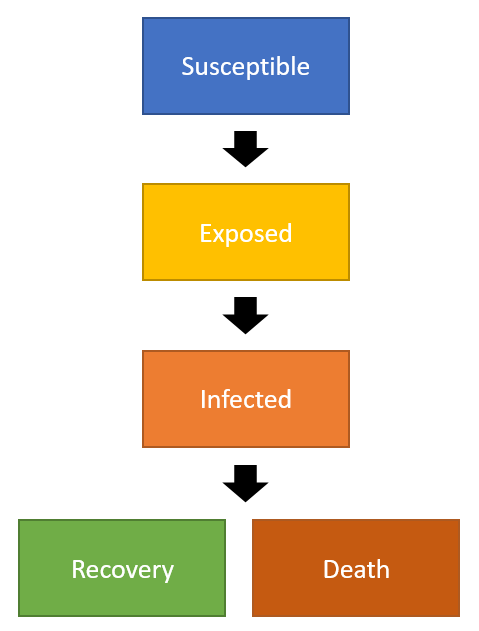

[//]: # (This is a comment that won't be rendered at github.io)
[//]: # (MD Cheat sheet: https://www.markdownguide.org/cheat-sheet/)

## Disclaimer
Uncertainty in the number of currently infected COVID-19 individuals, transmission rate, age-dependent mortality, re-introduction of infections from out-of-state, and changing contact networks throughout the state place extremely large uncertainties and caveats on the results and recommendations reported herein, which the consortium developed, tested, and consolidated in under 100 hours.

# Executive Summary
About 85% of the population of Idaho is predicted to be infected by COVID-19 over the next year.
An ensemble of models is developed and tuned to Idaho's demographics by researchers from Idaho's public 4-year colleges.
These models predict a peak in infected individuals---and therefore hospitalizations---will occur in July or August.
School closures and sheltering-in-place are predicted to delay the date at which the peak occurs and lower the maximum number of simultaneous hospitalizations, as are other strategies that limit physical contact between people.
Outbreaks of COVID-19 are predicted to occur after social distancing policies are lifted.
Therefore the overall recommendation is to impose the strictest realistic social distancing policies until state-wide COVID-19 testing is not a limiting factor in identifying infections.
**The only way to prevent 85% of the population from getting infected is to quarantine contageous individuals and doing so requires widespread, timely testing.**

Idaho may still have the opportunity to prevent widespread infection, hospitalization, and death, **IF** testing capacity can catch up during a period of rigid social distancing.
If testing cannot catch up and quarantining cannot be effectively deployed to prevent widespread infection, social distancing remains necessary to manage stress on Idaho's health care system and caregivers.
With roughly 2,500 hospital beds and 400 ventilators in the state (750 and 120 of which are available, respectively), predicting the timing and scale of regional COVID-19 hospitalizations is the core focus of this work.
Here [we][idaho] describe the ensemble of models tuned to Idaho's current demographics, their broad predictions, and limitations.
    
Click [HERE](https://public.tableau.com/profile/jeff.lingwall7921#!/vizhome/Statewide_SEIR_Projections_ver1/Dashboard12?publish=yes) to interact with SEIR predictions of infections and deaths for high-risk and low-risk populations at the district level across Idaho.

Click [HERE](https://benridenhour.shinyapps.io/COVID-19_ID/) to interact with SEIR-style predictions of city-specific hospitalizations.

Code and datasets used in this work are available on [github](https://github.com/idaho-covid-response). 
Presently [Eric Jankowski](mailto:ericjankowski@boisestate.edu) manages access to the Idaho Covid Response github team, though we anticipate making these repositories publicly available shortly.

# Introduction
Covid-19 (Coronovirus) was declared a pandemic by the World Health Organization (WHO) on January 30, 2020. According to [John Hopkins University](https://coronavirus.jhu.edu/map.html) as of March 23, 168 countries/regions have reported at least one Covid-19 case; there have approximately 400,000 confirmed cases of Covid-19 and 16,000 deaths. On March 13, when Idaho reported its first case, a total of 2,179 cases in the US, and 145,193 cases globally had been reported. 

On March 18, a call was sent out to identify a team of researchers to provide a report that would help predict the expected number of people in Idaho anticipated to contract Covid-19, how many of these would require hospitalization, and likely effects of different interventions. 

On March 20, a small team of researchers from Boise State University, Idaho State University, University of Idaho, Lewis and Clark, and Washington State University met with TJ Bliss (Board of Education), Martijn van Beek (Idaho Department of Health and Welfare) *[others important to mention]*. The information provided in the document is a short summary of the number of infected, hospitalized, and dead, we could expect to see in Idaho from Covid-19. 

We reiterate our above disclaimer: Modeling Covid-19 with numerical accuracy will only be possible in hindsight. 
No guarantees of numerical accuracy are made for the predictions that follow.
However, based on information available between March 20 and March 24, the following models and methods give a peek at what we might anticipate over the next year.

## Methods
We compare two implementations of SEIR (**Figure 1**) models, network scaling theory, and empirical fits to international COVID-19 outbreak data to infer epidemic progression in Idaho.
In the SEIR implementations evaluated here, errors in input parameters, population demographics, and initial conditions give rise to errors in preductions.
For instance, if the Exposed population is actually larger than we input into the models, the actual peak in infections will occur sooner than predicted by the models.
While the exact values for each parameter is not presently known, the values used here are within ranges that are informed by recent publications and observations of COVID-19's international spread.
We examine the sensitivity of the models to parameterizations within reported ranges (for example, death rates from Italy vary significantly from those reported from China, and recent reporting from the US indicates higher death rates for young individuals than in Italy), and we present predictions based on these ranges. 

<figure style="float:right;width:40%;margin-left:20px">

<figcaption><b>Figure 1</b> The primary models presented here calculate changes over time in how many people are Susceptible (S) to COVID-19, Exposed (E), Infected (I), Recovered (R) (hence, <b>SEIR</b>), and Dead. </figcaption>
</figure>

A simplistic approach of modeling Covid-19 starts with a number of people susceptible to an illness (in this case the Idaho population). 
People who are susceptible can become exposed, those who are exposed become infectious, and those who are infectious either recover or die. 
The rate at which people go from being susceptible to exposed to infected to recovery or death are major paramaters of the model, with changes in these paramters resulting in significant differences in predictions. 
This model is called a Susceptible, Exposed, Infected, and Removed (SEIR) model and it has been successfully used for other, similar, epidemics [cites please]. 
**Once recovered, people can become susceptible again - is this true for the models you are running?**.

The R0 is one of the parameters in the model, R0 is the average number of people an infected person will infect. 
An R0 of two means that, on average, each infected person will infect two other people.
An R0 of one means that, on average, each infected person will infect one other person.
An R0 of 0.5 means that, on average, for every two infected persons, only one person will become infected.
The exponential growth observed with Covid-19 is due to the R0 being greater than one (~2.3)
As social distancing increases, the average number of people who an infected person infects with Covid-19 reduces, resulting in a lower R0. Only when R0 is less than one will the spread of Covid-19 decrease.

*Figure 2 - image of Wuhan vs Italy infectious rates with Idaho data*
## Baseline assumptions

Unless otherwise stated, models repored here are parameterized based on observations from Italy, where the progression of the disease and mortality most closely matches the limited data collected from the US. 
Note that reported cases in the US are currently outpacing Italy's historical data, making the predictions that follow conservative (possible underestimates) of infection and death rates in the US and Idaho.
The SEIR-style models assume infected individuals have a mean-time to recovery ("1/gamma") of 12.9 days, and
* Italy age-based death rates from wikipedia
* Idaho age distributions by county
* R0 of about 2.3
* There are roughly 2,500 Hospital Available Beds for Emergencies and Disasters (HAvBED)
* There are roughly 400 ventilators in Idaho.
* Approximately 30% of these beds and ventilators are available for Covid-19 patients: Idaho has around 750 HAvBEDs and 120 ventilators.
* Day 1 of all models is March 22, with 47 confirmed cases.

*maybe move some of this to disclaimers?*
One concern is that the number of cases reported is an under-estimate. 
We anticipate that the number of cases on https://coronavirus.idaho.gov/ underestimates the current number of cases.
This is because not everyone is likely to present for testing (especially those who are asymptomatic), a potential lack of supplies such that not everyone with Covid-19 who presents is tested, and delays in processing tests and confirming and reporting cases. 

The number of cases in Idaho are required to accurately model Covid-19. 
Given the anticipated under-estimate in the number of officially reported cases three different scenarios were run.

## Core Scenarios
**Scenario 1**: The model uses the number of offically recorded Covid-19 cases as reported on Mar 22, 2020 (a total of 48 cases).
For simplicity, some of models set the seventh Public Health District (North Central), which was not reporting any cases on Mar 22, to have one case as well. 

**Scenario 2**: The model used five times the number of Covid-19 cases than were used in Model 1.

**Scenario 3**: The model used ten times the number of Covid-19 cases than were used in Model 1.

# Results
The number of reported Covid-19 cases by each US state have been increasing at an exponential rate.
We anticpate that the number of Covid-19 cases in Idaho will follow this exponential rate seen in the other states in the short term.
Figure 3 shows the number of cases reported by each US state, since the first day with cases reported. 
The number of Covid-19 cases data for Idaho is shown in red, and the predicted number of cases for Idaho for the next two weeks (if the spread continues at the same rate) is shown in blue.

<figure style="float:center;width:70%" align="center">

<figcaption><b>Figure 3 </b> Known cases of Covid-ID by state. Red line = Idaho reported, blue line = Idaho predicted</figcaption>
</figure>
 

**Scenario 1.** Starting with 48 cases in Idaho
- Time to peak:  roughly 150 days, August 16-22
- At peak:  
      - estimate 1: 1,000 hospitalizations, 20,000 symptomatic, 130,000 asymptomatic.
      - estimate 2: 239,000 infected
- Final outbreak size:  80.6%
- Total deaths: 400 (~315 deaths in 65+, ~70 in 55-64, and ~15 in 25-54)

**Scenario 2.** Starting with 240 cases in Idaho
- Time to peak: July 22,
- At peak:  
       - estimate 1: 
       - estimate 2: 239,000 infected
- Final outbreak size: 
- Total deaths: 

**Scenario 3.** Starting with 480 cases in Idaho
- Time to peak: July 10
- At peak:  
      - estimate 1: 
      - etimate 2: 239,000 infected
- Final outbreak size: 
- Total deaths: 

Figure 4 shows the anticipated number of infected, hospitalized, and deaths for Idaho if no mitigation is done. 
This suggests that if no mitigation is done the the peak number of infections will be [date range].
If there is no mitagation we anticpate that the ventilators wil be overwhelmed [date range], *resulting in an ever higher number of deaths - please let me know if your death rates take into account ventilators*.

*Figure predicted Idaho infected hospitilations, deaths showing range in predictions - send me your day 1-365 predictions*

## Conclusions
The limited number of tests being conducted, and the delay in testing results becoming available, is significantly hampering modeling efforts. It is difficult to accurately model Covid-19 in Idaho given the wide range of uncertainty in the model parameters. We ran a large number of models, 

Several different approaches to modelling Covid-19 in Idaho were used.
As each of the models is slightly different the predictions for each of the models are also different. 
At this point it is unclear which model is the most realistic. 

**If no social distancing measures are implemented**, all of the models suggest that the ventilators will become overwhelmed.
The date range that the ventilators will be overwhelmed ranges from [range].
This is assuming that there are *number ventilators in use for non-covid, for covid*.
While there is a range of dates here, the important thing to note is that all models suggest that the ventilators will be overwhelmed.
This is important as once the ventilators are overwhelmed the death rate is expected to increase.

With no social distancing we anticipate that the peak of infection will be between [date] and [date], with up to xx% of Idaho eventually effected. 

**With moderate social distancing** such as school closures and isolation of infected cases *what about working from home vs office, bars, restaurants etc* our models suggest that the ventilators will only be overwhelmed for some short periods.
If Idaho slows the spread by 50% (such as by shutting schools and isolate Covid-19 cases) then ventilators will be available for the majority of the time.

**With strong social distancing** our predictions suggest that ventilators will be overwhelmed if no social distancing effort are put in place.  If Idaho slows the spread by 60% (such as by shutting schools, isolating Covid-19 cases, and *xxxx*) then ventilators would be available in Idaho (not necessarily) for the majority of the time. 

**Overall summary**
The number of cases reported in Idaho likely has a delay, such that it may take several days for a person with Covid-19 who is tested to be officially confirmed and reported. This means that any intervention will also have a delay in reducing the number of cases in Idaho. If there is a week-long delay between testing and results, it will take one week before the results of any intervention can start to be seen. As the current growth of Covid-19 is exponential, a one-week delay (for instance) would result in the actual numbers in Idaho being much, much, higher than what is reported. Given this exponential growth we suggest a period of social distancing while the extent of Covid-19 in Idaho is determined.

Not testing - This is a significant problem as if the number of people who are infected is unknown, it becomes very difficult to predict how many people will be infected in the future.

One suggestion that balances the demands of economics and health is to have a (hopefully short) period of strong social distancing while mass testing is ramped up to large levels. This would allow health workers to determine where Covid-19 is, and ensure infected cases were isolated. This period would allow researchers and healthworkers to determine how widespread and severe Covid-19 is in Idaho. 
After this period of strong social distancing a period of relaxed social distancing measures could be implemented, ramping up to strong social distancing as needed (if the number of cases was at risk of exceeding hospital demand).

If people who are likely immune (based on prior exposure or serology) are not infections, there is no reason for these people to not  get back to normal economic activity. PCR tests and serology (once available) will indicate how many people are likely immune from this current Covid-19 virus. 

The models will be more accurate once more testing is implemented, or when we death data starts to be available.

The first cases of Covid-19 in Idaho were observed after other states were infected. By tracking the number of cases reported by state we may be able to see how well different intervention strategies have worked elsewhere in the US.

Large-scale testing will help create more accurate future predictions researchers. While death data (once available) will help with improving the predictions, relying on testing is preferrable for obvious reasons. 

Providing more detailed information on who is infected by Covid-19 (e.g., age, gender, comorbidities) will help future predictions be more accurate.

## Additional information 
For more information specific to Idaho, see the following websites:

A visual summary of trends over time in Idaho: https://rpubs.com/IrenevanWoerden/588295 

[A dashboard with multiple parameters](https://benridenhour.shinyapps.io/COVID-19_ID/)

[A dashboard with multiple parameters that shows potential effect on ventilator and ICU capacity by public health district](https://public.tableau.com/profile/jeff.lingwall7921#!/vizhome/Statewide_SEIR_Projections_ver1/Dashboard12?publish=yes)

* [Team][idaho]
* [Sources](sources)

[//]: # (Links below)
[idaho]: team
